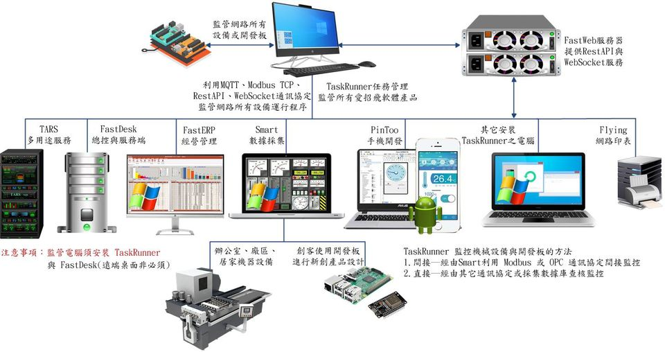

# TaskRunner
TaskRunner是智慧維護管理器，協助企業運維單位進行運維管理，將部署不同城市和位置的相關裝置，通過工業云平臺(愛招飛相關產品)與TaskRunner集中統一管理，賦予傳統裝置與電腦物聯網化，從而提升企業運維效率與運維水平。社區版僅供個人且非商業使用。

> **加入 Facebook 社團**
>
> [https://www.facebook.com/groups/isoface/](https://www.facebook.com/groups/isoface/)
> 
> **點讚追蹤 Facebook 粉絲專頁**
> 
> [https://www.facebook.com/AIOT.ERP](https://www.facebook.com/AIOT.ERP)

工業監控裝置，幾乎都是由電腦負責監測並控制裝置的執行。如果反過來做是什情況?

例如機電裝置或者ESP32、Arduino開發板，依據週遭環境的變動，主動發送訊息，要求Windows 桌面程式或者 Android APK，執行下列指定的任務
* 指定遠端電腦重啟或關閉。
* 指定遠端電腦執行或關閉指定的程序。
* 指定遠端資料庫執行指定的SQL程序，例如過帳或轉帳等批次作業。
* 通知Android手機中執行的PinToo程序，執行指定的任務程序。
* 開發板採集數據(照片、視訊、音訊)，發送遠地電腦，配合接收數據執行指定程序。
* 開發板採集數據(照片、視訊、音訊)，發送遠地資料庫，配合接收數據執行指定的SQL程序。
* 開發板自訂程序，發送遠地電腦，執行該自訂程序。
* 將機電裝置、開發板、感測器的執行狀況，隨時回報，避免因意外中斷服務。

企業資源計劃(ERP)與物聯網(IOT)的應用推動了各行業智慧化發展，在各產業相關領域，都已漸成規模，其未來工作重心趨勢將由「建」變為「管」，因此對管理部門形成巨大的挑戰。使用TaskRunner任務執行器，協助工廠解決以下資源裝置運維問題：
* 資源裝置管理涉及企業內外範圍廣：電腦與裝置數量龐大、數據型別眾多、管理整合問題。
* 故障排查難度大：電腦與物聯網感知層數據多源異構，難以第一時間獲取各類資源執行狀態，及時發現隱患。
* 日常工作繁瑣：各部門營運工作多，工作協作力淺、無法及時監測。
* 裝置資源效益評估：從數位化角度，評估裝置資源執行效率。

TaskRunner重點圍繞在電腦裝置執行程序，自訂程序設計，進行遠端監控、警示、管理。隨著越來越多物聯網設施的投入使用，現場管理人員迫切需要網運維管理工具，即時、直觀地監控大量電腦與裝置的執行和異常情況。TaskRunner整合數位化硬體資源，通過MQTT、Modbus TCP、RestFul、WebSockets通訊協定，實現裝置遠端安全運維管理。為工廠經營管理與物聯網系統，提供全面遠端監控、故障診斷、預警、報警、處理等運維任務，提高裝置管理過程中裝置問題的反應及執行效率。從而達到精細管理、降低成本增加營運效能之目的。

TaskRunner特色：
1.	可本地部署，作為電腦維護管理的一部分，跟隨系統管理方法的改變而變更。
2.	可網際網路部署，實現公共網路連線的裝置與服務的維護。
3.	可根據企業不同的管理需求，量身定製自動化任務。
4.	支援MQTT訊息的解析與處理，可作為計算閘道器監控使用。
5.	支援RestAPI功能，可自行建立定義RestAPI，以提供裝置RestAPI訪問支援。
6.	支援通過WebSocket發送數據儲存指令，實現簡易數據轉存功能。
7.	連線的通訊(HTTP WebSocket MQTT)均支援SSL連線，保障通訊連線的數據安全。
8.	自定程式可選用JavaScript引擎、Pascal引擎與PowerSehll引擎，使用者自主開發設計，交付給TaskRunner編譯執行。
9.	自定程式支援HTTP、WebSocket與MQTT三種方式呼叫使用，均支援使用SSL	連線。可結合愛招飛開發軟體或其他第三方軟體實現靈活呼叫執行。
10.	自定執行程式的監測方法，協助使用者監控電腦，處理程序的執行狀況。當監控程序發現問題，可自選三種處理方式自動處理，包括髮送警示訊息等。
11.	支援使用物聯網裝置與開發板來呼叫自定程式、RestAPI、MQTT自定程式等功能。
12.	界面語言支援多語言顯示，可選擇的語言型別為簡體中文、繁體中文與英語。

TaskRunner運用場景：

1．	可作為雲端計算伺服器使用，輸入特定的條件以獲取反饋結果。
2．	ERP生產數據可通過TaskRunner自動化任務定時計算彙總，幫助實時跟蹤生產情況。
3．	實現自動備份功能。通過自動化任務建立自動備份服務，實現資料庫的定時自動備份。
4．	作為監測服務使用，檢測裝置與服務執行情況，及時掌控異常情況，支援快速處置問題，有效縮短髮現和排查問題的時間，提高解決問題的效率。
5．	作為邊緣計算伺服器，解析閘道器採集傳輸的數據，計算並存儲數據。
6．	作為遠端服務觸發器，可遠端控制伺服器中的程式，實現遠端啟動或停止執行。
7．	作為遠端採集終端，可通過通訊埠、ModbusTCP、MQTT等方式採集、計算數據，利用WebSocket、HTTP、MQTT遠端發送結果。

目前 TaskRunner 已包含下述示例：

## 自定程式

|示例名稱|示例說明|
|---|---|
|呼叫 Chrome 打開網頁|任務執行器 TaskRunner 通過自定程式，呼叫 Chrome 瀏覽器打開指定的URL|
|呼叫 Smart 打開指定專案|任務執行器 TaskRunner 通過自定程式，呼叫 Smart 打開指定的程式專案|
|呼叫 FastDesk 邀請遠端控制|任務執行器 TaskRunner 通過自定程式，呼叫遠端控制工具 FastDesk ，邀請對方來遠端控制本機|
|呼叫FastDesk主動遠端控制|任務執行器 TaskRunner 通過自定程式，呼叫遠端控制工具 FastDesk ，通過本機遠端控制目標主機|
|開啟TARS|任務執行器 TaskRunner 通過自定程式，呼叫 TARS 執行啟動|
|關閉TARS|任務執行器 TaskRunner 通過自定程式，呼叫 TARS 執行關閉|
|重啟計算機|任務執行器 TaskRunner 通過自定程式，呼叫計算機執行重啟|
|關閉計算機|任務執行器 TaskRunner 通過自定程式，呼叫計算機執行關機操作|
|讀取資料庫轉JSON輸出|任務執行器 TaskRunner 通過自定程式，呼叫預設的資料庫設定連線資料庫。通過資料庫查詢語句，執行資料庫查詢，並將獲取的結果以 JSON 格式返回|
|資料庫備份|任務執行器 TaskRunner 通過自定程式，呼叫數據查詢執行備份操作|
|RS232 電子秤讀數|任務執行器 TaskRunner 通過自定程式，以通訊埠通訊的方式讀取電子秤的讀數，並解析顯示|
|呼叫FastWeb RestAPI|任務執行器 TaskRunner 通過自定程式，通過 RestAPI 訪問 FastWeb，獲取返回的結果|
|資料庫寫入|任務執行器 TaskRunner 通過自定程式，呼叫數據查詢，根據URL參數引入寫入的數據，執行數據寫入操作|

## 執行衛士

|示例名稱|示例說明|
|---|---|
|監控電腦執行程式|任務執行器 TaskRunner 通過執行衛士，監控電腦程式的執行狀態，併發出警告訊息|

## 自動化作業

|示例名稱|示例說明|
|---|---|
|定時執行程式開啟關閉|任務執行器 TaskRunner 通過自動化作業，使程式能在設定的時間開啟關閉|
|定時數據推送|任務執行器 TaskRunner 通過自動化作業，定時向 IsoBean 推送數據，使 IsoBean 實現數據的動態更新功能|
|定時備份資料庫|任務執行器 TaskRunner 通過自動化作業，定時執行資料庫的備份任務|

* **TaskRunner 簡介**：https://isoface.net/isoface/production/tool/taskrunner
* **TaskRunner 幫助手冊**：https://isoface.net/isoface/doc/taskrunner/main/
* **TaskRunner 快速上手**：https://isoface.net/isoface/study/quick-start/tars-2/taskrunner
